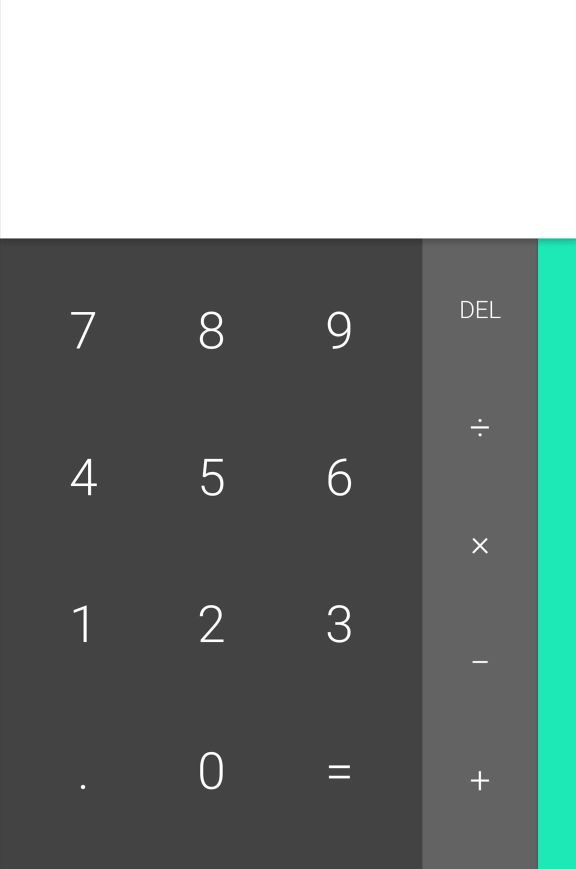

# Assignment #3. The Calculator

The assignment is to make your first Android application.

TTHe basic structure of the app is already present in the repository.

You need to implement a ViewModel and Layout parts of it. 

The connection between ViewModel and Layout is implemented with [DataBinding](https://developer.android.com/topic/libraries/data-binding).

The funvtional part of view model is described in Calculator interface.

